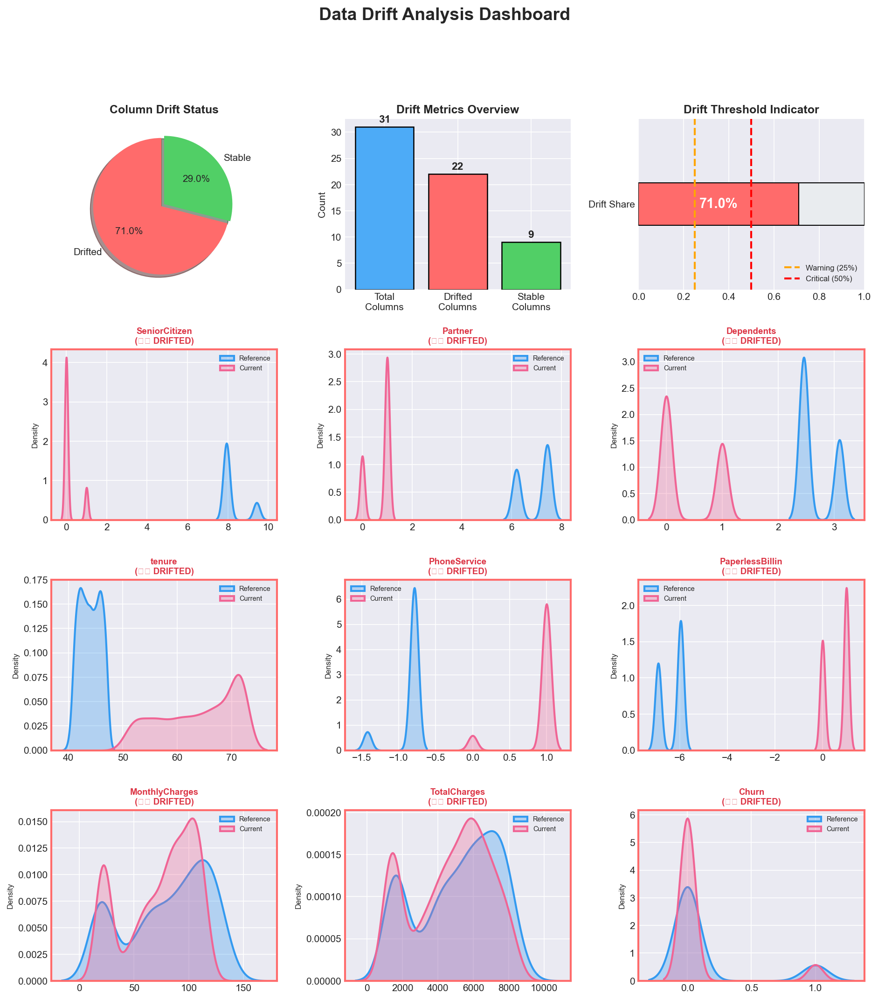

# 🔍 Human-in-the-Loop Drift Detection Pipeline

A complete MLOps pipeline for detecting data drift and enabling human-approved model retraining. This project demonstrates best practices for monitoring ML models in production with a visual web interface.


## � Drift Visualization



## �📋 Table of Contents

- [Overview](#-overview)
- [Features](#-features)
- [Project Structure](#-project-structure)
- [Installation](#-installation)
- [Usage](#-usage)
- [Web Interface](#-web-interface)
- [How It Works](#-how-it-works)
- [Configuration](#-configuration)

## 🎯 Overview

This pipeline automatically detects when production data has drifted from training data, alerts stakeholders through a visual dashboard, and enables human-approved model retraining. It's designed for scenarios where automatic retraining is risky and human oversight is required.

## ✨ Features

- 📊 **Automated Drift Detection** - Uses Evidently AI to detect statistical drift in data distributions
- 🌐 **Interactive Web Dashboard** - Beautiful web interface to review drift metrics and approve actions
- 👤 **Human-in-the-Loop** - Requires human approval before retraining models
- 📈 **Visual Reports** - Generates charts showing drift severity and distribution comparisons
- 🔄 **One-Click Retraining** - Approve model retraining with a single click
- ⚡ **Demo Mode** - Reset button to simulate high drift for demonstrations

## 📁 Project Structure

```
HIL/
├── data/
│   ├── reference.csv      # Baseline/training data
│   └── current.csv        # Production/incoming data
├── models/
│   └── churn_model_v2.pkl # Trained model
├── reports/
│   ├── drift_report.html  # Evidently HTML report
│   ├── drift_report.json  # Drift metrics in JSON
│   └── drift_visualizations.png  # Visual charts
├── secrets/
│   └── kaggle.json        # Kaggle API credentials (optional)
├── src/
│   ├── detect_drift.py    # Drift detection with visualizations
│   ├── load_data.py       # Data loading utilities
│   ├── pipeline.py        # CLI-based pipeline
│   ├── preprocess.py      # Data preprocessing
│   ├── retrain_model.py   # Model retraining script
│   ├── train.py           # Initial model training
│   └── web_pipeline.py    # Web-based pipeline with UI
├── requirements.txt       # Python dependencies
└── README.md
```

## 🚀 Installation

### Prerequisites

- Python 3.10 or higher
- pip (Python package manager)
- Kaggle account (optional, for downloading latest data)

### Step 1: Clone the Repository

```bash
git clone [<repository-url>](https://github.com/MHM-Rajpoot/HIL-DP/tree/main)
cd HIL
```

### Step 2: Create Virtual Environment

```bash
# Create virtual environment
python -m venv venv

# Activate virtual environment
# On Windows:
.\venv\Scripts\activate

# On macOS/Linux:
source venv/bin/activate
```

### Step 3: Install Dependencies

```bash
pip install -r requirements.txt
```

Or install packages individually:

```bash
pip install pandas numpy scikit-learn matplotlib seaborn evidently joblib kaggle
```

### Step 4: Setup Kaggle API (Optional)

If you want to download the latest data from Kaggle:

1. **Get your Kaggle API credentials:**
   - Go to [Kaggle](https://www.kaggle.com) → Account → API → Create New Token
   - This downloads a `kaggle.json` file

2. **Place the credentials in the secrets folder:**
   ```bash
   # Create secrets folder if it doesn't exist
   mkdir secrets
   
   # Copy your kaggle.json to secrets folder
   cp ~/Downloads/kaggle.json secrets/kaggle.json
   ```

3. **Load data using the CLI:**
   ```bash
   # This automatically uses kaggle.json from secrets/ folder
   python src/load_data.py
   ```
   
   This will:
   - Authenticate with Kaggle API using `secrets/kaggle.json`
   - Download the Telco Customer Churn dataset
   - Save it to `data/raw/telco.csv`

   **Expected output:**
   ```
   ⬇ Downloading Telco Customer Churn dataset...
   ✅ Dataset downloaded using project-local kaggle.json
   ```

4. **Preprocess the data:**
   ```bash
   python src/preprocess.py
   ```
   
   This creates `data/reference.csv` and `data/current.csv` for drift detection.

> ⚠️ **Important:** Never commit your `kaggle.json` to version control! The `secrets/` folder should be in `.gitignore`.

## 💻 Usage

### Option 1: Web Interface (Recommended)

Launch the interactive web dashboard:

```bash
python src/web_pipeline.py
```

This will:
1. Run drift detection
2. Generate visual reports
3. Open `http://localhost:8050` in your browser
4. Display the dashboard with drift metrics

### Option 2: Command Line Interface

Run the CLI-based pipeline:

```bash
python src/pipeline.py
```

This will:
1. Detect drift
2. Show metrics in terminal
3. Prompt for retraining approval (y/n)

### Individual Scripts

**Run drift detection only:**
```bash
python src/detect_drift.py
```

**Train initial model:**
```bash
python src/train.py
```

**Retrain model manually:**
```bash
python src/retrain_model.py
```

## 🌐 Web Interface

The web dashboard at `http://localhost:8050` provides:

### Drift Metrics Panel
- **Total Columns** - Number of features analyzed
- **Drifted Columns** - Features with significant drift
- **Drift Ratio** - Percentage of drifted features
- **Threshold** - Configurable drift threshold (default: 25%)

### Severity Indicator
- 🟢 **LOW** (<25%) - Acceptable drift levels
- 🟡 **MEDIUM** (25-50%) - Consider monitoring
- 🔴 **HIGH** (>50%) - Retraining recommended

### Action Buttons
| Button | Description |
|--------|-------------|
| ✅ **Approve Retraining** | Retrain model with combined data |
| ❌ **Reject** | Decline retraining, no changes made |
| 🔄 **Refresh Analysis** | Re-run drift detection |
| ⚡ **Reset Demo** | Simulate high drift for demonstration |

### Visual Analysis
- Pie chart showing drifted vs stable columns
- Bar chart with drift metrics
- Drift threshold gauge
- Distribution comparison plots

## ⚙️ How It Works

### 1. Drift Detection
```
Reference Data (training) ──┐
                            ├── Statistical Tests ── Drift Report
Current Data (production) ──┘
```

The pipeline compares statistical distributions between reference and current data using various tests (KS test, Chi-square, etc.).

### 2. Human Review
When drift exceeds the threshold:
- Dashboard displays warning
- Human reviews drift report
- Human approves or rejects retraining

### 3. Retraining (if approved)
- Combines reference + current data
- Trains new Random Forest model
- Updates reference baseline
- Regenerates reports

## 🔧 Configuration

### Drift Threshold

Edit `src/web_pipeline.py` or `src/pipeline.py`:

```python
DRIFT_THRESHOLD = 0.25  # 25% of columns must drift to trigger action
```

### Model Parameters

Edit `src/retrain_model.py`:

```python
model = RandomForestClassifier(
    n_estimators=400,
    max_depth=10,
    random_state=42
)
```

### Web Server Port

Edit `src/web_pipeline.py`:

```python
PORT = 8050  # Change to desired port
```

## 📊 Sample Output

### Terminal Output
```
============================================================
🚀 Starting Human-in-the-Loop Drift Pipeline (Web Interface)
============================================================

📊 Running drift detection...

──────────────────────────────────────────────────
⚠  Dataset Drift Detected: 🔴 YES
📊 Share of Drifted Columns: 51.61%
📈 Drifted: 16 / 31 columns
──────────────────────────────────────────────────
📋 Severity: 🔴 HIGH - Retraining recommended!
──────────────────────────────────────────────────

🌐 Web interface available at: http://localhost:8050
```

## 🛠️ Troubleshooting

### Port Already in Use
```bash
# Kill process on port 8050 (Windows)
netstat -ano | findstr :8050
taskkill /PID <PID> /F
```

### Module Not Found
```bash
pip install <missing-module>
# or reinstall all requirements
pip install -r requirements.txt
```

### Virtual Environment Issues
```bash
# Recreate virtual environment
Remove-Item -Recurse -Force venv
python -m venv venv
.\venv\Scripts\activate
pip install -r requirements.txt
```

## 📝 License

This project is for educational and demonstration purposes.

## 🤝 Contributing

1. Fork the repository
2. Create a feature branch
3. Make your changes
4. Submit a pull request

---

**Built with ❤️ for MLOps best practices**

